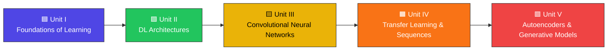

<div align="center">


# 🧠 Deep Learning Laboratory

### *Artificial Intelligence & Machine Learning*


<br/>


<br/>


</div>

> 🔧 **Before you publish:** replace every `your-username` placeholder in this README (badges, clone URL, star-history link) with your actual GitHub username.

---

## 📑 Table of Contents

- [📖 About This Repository](#toc-about)
- [🎓 Academic Details](#toc-academic)
- [🛠 Tech Stack](#toc-tech)
- [🗺 Learning Path](#toc-roadmap)
- [📚 Course Contents](#toc-contents)
- [📂 Repository Structure](#toc-structure)
- [📈 Progress Tracker](#toc-progress)
- [🚀 Getting Started](#toc-start)
- [📘 Reference Books](#toc-books)
- [🌟 Star History](#toc-stars)
- [📄 License & Usage](#toc-license)
- [🤝 Feedback & Contributions](#toc-feedback)
- [👨‍💻 Author](#toc-author)

---

<a name="toc-about"></a>
## 📖 About This Repository

This repository documents my laboratory work, implementations, and mini-experiments for **MLA0406 – Deep Learning**, part of the B.Tech (AI & ML) curriculum at Saveetha Engineering College.

Content is organized **unit-by-unit**, mirroring the official course syllabus — starting from the mathematical foundations of learning algorithms and building up to modern generative models. The repository will keep growing across the semester as each lab session is completed.

---

<a name="toc-academic"></a>
## 🎓 Academic Details

| 📌 Information | Details |
|---|---|
| **Course Code** | MLA0406 |
| **Course Name** | Deep Learning |
| **Department** | Artificial Intelligence & Machine Learning |
| **Programme** | B.Tech – AI & ML |
| **Institution** | Saveetha Engineering College (SIMATS) |
| **Faculty** | Dr. G. Bindu |
| **Programming Language** | Python |
| **Core Libraries** | NumPy, TensorFlow, Keras, Matplotlib |
| **IDE** | VS Code / Jupyter Notebook |

---

<a name="toc-tech"></a>
## 🛠 Tech Stack

<div align="center">


</div>

| Category | Tools |
|---|---|
| Language | Python |
| Numerical Computing | NumPy |
| Deep Learning Frameworks | TensorFlow, Keras |
| Visualization | Matplotlib |
| Version Control | Git, GitHub |
| Development Environment | VS Code, Jupyter Notebook |

---

<a name="toc-roadmap"></a>
## 🗺 Learning Path

The course builds progressively, with each unit laying the groundwork for the next:



---

<a name="toc-contents"></a>
## 📚 Course Contents

<details>
<summary><b>🟦 UNIT I — Introduction to Deep Learning</b></summary>

- Learning Algorithms
- Maximum Likelihood Estimation
- Building a Machine Learning Algorithm
- Neural Networks & Multilayer Perceptron
- Backpropagation Algorithm and Its Variants
- Stochastic Gradient Descent
- Curse of Dimensionality

</details>

<details>
<summary><b>🟩 UNIT II — Deep Learning Architectures</b></summary>

- Machine Learning vs. Deep Learning
- Representation Learning
- Width and Depth of Neural Networks
- Activation Functions: ReLU, Leaky ReLU (LReLU), ERELU
- Unsupervised Training of Neural Networks
- Restricted Boltzmann Machines
- Autoencoders
- Deep Learning Applications

</details>

<details>
<summary><b>🟨 UNIT III — Convolutional Neural Networks</b></summary>

- Architectural Overview & Motivation
- Layers & Filters
- Parameter Sharing
- Regularization
- Popular Architectures: AlexNet, ResNet
- Applications

</details>

<details>
<summary><b>🟧 UNIT IV — Transfer Learning & Sequence Modelling</b></summary>

- Transfer Learning Techniques
- CNN Variants: DenseNet, PixelNet
- Recurrent Neural Networks (RNNs)
- Bidirectional RNNs
- Encoder–Decoder (Sequence-to-Sequence) Architectures
- Backpropagation Through Time (BPTT)
- Long Short-Term Memory (LSTM) Networks

</details>

<details>
<summary><b>🟥 UNIT V — Autoencoders & Deep Generative Models</b></summary>

- Undercomplete Autoencoders
- Regularized Autoencoders
- Stochastic Encoders and Decoders
- Contractive Autoencoders
- Deep Belief Networks
- Boltzmann Machines & Deep Boltzmann Machines
- Generative Adversarial Networks (GANs)

</details>

---

<a name="toc-structure"></a>
## 📂 Repository Structure

```text
📦 MLA0406-Deep-Learning
┣ 📂 Unit-01-Foundations
┣ 📂 Unit-02-DL-Architectures
┣ 📂 Unit-03-CNN
┣ 📂 Unit-04-Transfer-Learning-Sequences
┣ 📂 Unit-05-Autoencoders-GANs
┣ 📂 Assignments
┣ 📂 Datasets
┣ 📜 README.md
┗ 📜 requirements.txt
```

> 📌 Folder names are suggestions — rename them to match however you organize your lab sessions.

---

<a name="toc-progress"></a>
## 📈 Progress Tracker

**Overall completion:** `▓▓░░░░░░░░` ~20%

| Module | Topics | Status |
|---|---|---|
| 🟦 Unit I — Introduction to Deep Learning | 7 |  |
| 🟩 Unit II — Deep Learning Architectures | 8 |  |
| 🟨 Unit III — Convolutional Neural Networks | 6 |  |
| 🟧 Unit IV — Transfer Learning & Sequence Modelling | 7 |  |
| 🟥 Unit V — Autoencoders & Deep Generative Models | 7 |  |

> 📌 Update the badges as you go: `lightgrey` (Upcoming) → `yellow` (In Progress) → `success` (Completed).

---

<a name="toc-start"></a>
## 🚀 Getting Started

**1. Clone the repository**

```bash
git clone https://github.com/your-username/MLA0406-Deep-Learning.git
cd MLA0406-Deep-Learning
```

**2. (Optional) Create a virtual environment**

```bash
python -m venv venv
source venv/bin/activate      # Windows: venv\Scripts\activate
```

**3. Install dependencies**

```bash
pip install -r requirements.txt
```

**4. Run a lab program**

```bash
python Unit-01-Foundations/filename.py
```

<details>
<summary><b>📄 Sample <code>requirements.txt</code></b></summary>

```text
numpy
tensorflow
keras
matplotlib
jupyter
```

</details>

---

<a name="toc-books"></a>
## 📘 Reference Books

**Text Books**

| # | Title | Author(s) | Publisher, Year |
|---|---|---|---|
| 1 | *Deep Learning* | Ian Goodfellow, Yoshua Bengio & Aaron Courville | MIT Press, 2016 |
| 2 | *Deep Learning with Python* (2nd Ed.) | François Chollet | Manning, 2021 |

**References**

| # | Title | Author(s) | Publisher, Year |
|---|---|---|---|
| 1 | *Deep Learning: A Practitioner's Approach* | Josh Patterson & Adam Gibson | O'Reilly Media, 2017 |
| 2 | *Grokking Deep Learning* | Andrew W. Trask | Manning Publishers, 2019 |
| 3 | *Data Science from Scratch* (2nd Ed.) | Joel Grus | O'Reilly, 2019 |
| 4 | *Pattern Recognition and Machine Learning* | Christopher M. Bishop | Springer, 2006 |

---

<a name="toc-stars"></a>
## 🌟 Star History

If this repository helped you, consider giving it a star ⭐ — it helps others discover it too.

<a href="https://star-history.com/#your-username/MLA0406-Deep-Learning&Date">
  
</a>

---

<a name="toc-license"></a>
## 📄 License & Usage


This repository is maintained for **educational and portfolio purposes** as part of coursework at Saveetha Engineering College.

> ⚠️ **Academic Integrity:** if you're a fellow student, please attempt each lab exercise yourself before consulting this code — the goal is to understand, not copy.

Want to open-source it more formally? Consider adding an [MIT License](https://choosealicense.com/licenses/mit/).

---

<a name="toc-feedback"></a>
## 🤝 Feedback & Contributions

This is primarily a personal coursework repository, but if you spot an issue or have a cleaner implementation to suggest:

- Open an [Issue](https://github.com/your-username/MLA0406-Deep-Learning/issues)
- Or submit a [Pull Request](https://github.com/your-username/MLA0406-Deep-Learning/pulls)

Fellow AI & ML students are welcome to fork this for reference. 🙂

---

<a name="toc-author"></a>
## 👨‍💻 Author

<div align="center">

### Paleru Dharani Govardhan

**B.Tech – Artificial Intelligence & Machine Learning**
**Saveetha Engineering College (SIMATS)**

**Course:** MLA0406 – Deep Learning · **Faculty:** Dr. G. Bindu

### ⭐ If you found this repository useful, consider giving it a star!


</div>
